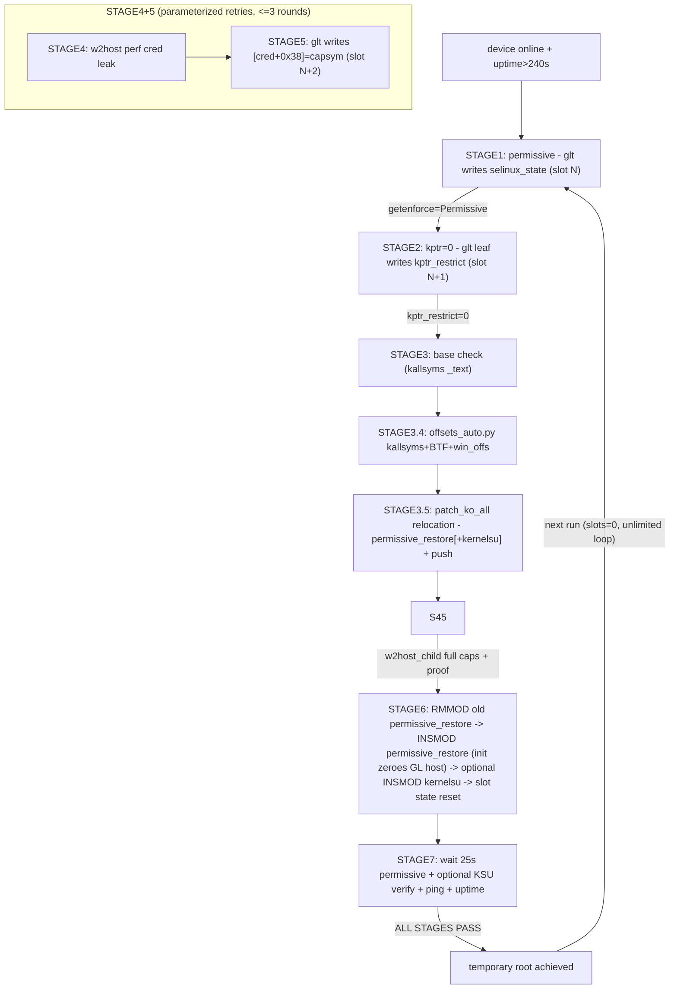

# GhostLock-X200 — architecture & flow

> Scope: the released repository state (post package cleanup). For usage see
> README.md; for upstream/provenance see NOTICE / THIRD_PARTY_NOTICES.md.

## 1. Overview

Temporary-root toolchain for the vivo X200 (PD2415 / Dimensity 9400 / b57
kernel 6.6.89) built on CVE-2026-43499 (GhostLock).

```mermaid
flowchart LR
    subgraph PC[Windows PC]
        PS["root_full_permissive_restore.ps1 (STAGE1-7)"]
        PY["Python tools: offsets_auto / patch_ko_all / rootcmd_client"]
        OFF["win_offs_b57.json image offsets"]
    end
    subgraph DEV[Device side (Android)]
        GLT["glt write-primitive engine"]
        W2["w2host cred leak + CAPSROOT + rootcmd"]
        SU["su_daemon root shell service"]
        KSU["kernelsu.ko (shipped in-tree, GPL-2.0-only)"]
        MR["permissive_restore.ko (permissive + host zeroing)"]
    end
    subgraph KERN[Kernel objects]
        ZERO["__dump_skip.zeroes 4KB GL_LOCK host (256 slots)"]
        SE["selinux_state"]
        KR["kptr_restrict"]
        CRED["cred (cap_permitted)"]
    end
    PS -- adb push/exec --> GLT & W2 & MR & KSU & SU
    PS -- adb forward + python --> W2
    PS -- read/inject --> OFF
    PS -- offsets_auto dynamic values --> GLT
    GLT -- "rb_erase write primitive" --> SE & KR & CRED
    GLT -- "trylock pollution/reuse" --> ZERO
    W2 -- "perf sampling cred leak" --> CRED
    W2 -- "CAPSROOT then insmod" --> MR & KSU
    MR -- "25s permissive restore + init zeroing" --> SE & ZERO
    KSU -- "root management + module loading" --> SU
```

## 2. Repository layout

### 2.1 `exploit/` — device-side exploit sources (`src/` + `vendored/` + `assets/` + `build/`; NDK cross-compile -> glt / w2host)

| File | Function |
|---|---|
| `main.c` | entry `run_exploit`: routing (GL_USE_SLIDE / GL_FOPS_HIJACK / PHYSRW); waiter/owner/consumer 3-thread model |
| `slide.c` | **core write-primitive engine**: pselect stack overwrite of a dangling rt_waiter words[]; SIGUSR1 remove_waiter -> chain walk -> rb_erase "write-anywhere"; GL_LOCK/GL_TARGET/GL_W0/GL_TASK_W2/GL_TARGET_LEAF fully parameterized; event-sync deterministic timing |
| `fops.c` | fd_set words construction + pselect routing + fops hijack (KASLR leak, configfs read primitive) |
| `pipe.c` | pipe object slab spray + PHYSRW physical read/write |
| `util.c` | payload layout construction: fake_lock/fake_fops/fake_task words, SKB payload, mm slab spray context; kernelsnitch helpers |
| `root.c` | root verification: selinux/uid/capable probes, capset escalation, file write check |
| `preload.c` | post-privesc payload: tmpfs mount, su daemon deployment, wallpaper camouflage |
| `su_daemon.c` | root shell daemon: unix socket service; handles vivo PR_SET_KEEPCAPS quirk (PR_SET_SECUREBITS) |
| `physscan.c` | physical memory scan/verification (with PHYSRW) |
| `w2host.c` | **cred leak + CAPSROOT + rootcmd**: perf sampling getuid/geteuid IP-window leak of child cred; capset full escalation; rootcmd socket (ID/READ/WRITE/INSMOD/RMMOD/EXEC) |
| `common.h` / `target_x200.h` | constants: SKB/pipe/mm layout, PAGE_OFFSET, b57 struct offsets |
| `su_blob.S` / `wallpaper_blob.S` / `standalone_main.c` / `physscan_stub.c` | embedded assembly blobs and standalone entry |
| `offset.h` / `kernelsnitch/` | vendored IonStack (Apache-2.0) components: TARGET_CONFIG_H shim + mm_struct leak headers |
| `build_glt_esync.sh` / `build_w2host.sh` | self-contained NDK build scripts (aarch64-linux-android28-clang; -o/-n parameters) |

### 2.2 `modules/permissive_restore/`

| File | Function |
|---|---|
| `permissive_restore.c` | init: restore initialized=1, zero GL host (unlimited privilege per boot), commit_creds(root); worker: 25s byte-write enforcing=0, then waits on kthread_should_stop() (no rmmod UAF) |
| `Makefile` / `build_permissive_restore.sh` | Kbuild (`obj-m := permissive_restore.o`) + parameterized build (KSRC/CC/LD) |
| `permissive_restore.ko` | prebuilt module shipped in-tree (built from source, GPL-2.0-only; repatch with patch_ko_all.py before INSMOD) |

### 2.3 `modules/kernelsu/` — KernelSU kernel module (vendored)

| File | Function |
|---|---|
| `kernelsu.ko` (+`.license`) | prebuilt module shipped in-tree (official KernelSU v3.2.5 release asset `android15-6.6_kernelsu.ko` + vermagic rewrite for X200 b57 via `patch_vermagic.py`; GPL-2.0-only; vermagic matches b57; repatch with patch_ko_all.py before INSMOD) |
| (corresponding source) | official KernelSU v3.2.5 `kernel/` @ `b0bc817b` (https://github.com/tiann/KernelSU, GPL-2.0-only; see SOURCE-URLS.md) |

### 2.4 `tools/` — PC-side scripts (`scripts/` + `offset_tools/`)

| File | Function |
|---|---|
| `scripts/root_full_permissive_restore.ps1` | **main script** STAGE1-7: permissive -> kptr -> offsets -> cred leak -> CAPSROOT -> INSMOD -> verify; GL_LOCK slot rotation; parameterized retries; permissive_restore unlimited-privilege |
| `scripts/root_full_official.ps1` | legacy control (KSU only, enforcing stays; hardcoded b57 addresses - COMPATIBILITY) |
| `offset_tools/offsets_auto.py` | dynamic offsets synthesis: kallsyms(base+capsym) + BTF(struct offsets) + win_offs(image) |
| `offset_tools/patch_ko_all.py` | ko relocation (absolute addresses from current-boot kallsyms; `__versions` strip) |
| `offset_tools/win_offs_b57.json` | b57 image-intrinsic offsets (device-derived, GENERATED - see REUSE.toml) |
| `offset_tools/rootcmd_client.py` | rootcmd socket client |
| `offset_tools/unpack_boot.py` | boot.img unpacking (payload extraction uses an external tool - see README) |
| `scripts/restart_w2.sh` | device-side helper (restart W2 host) |

### 2.5 Other

| Path | Function |
|---|---|
| `SOURCE-URLS.md` | external/upstream sources with revisions |
| `LICENSE` / `NOTICE` / `THIRD_PARTY_NOTICES.md` / `LICENSES/` / `REUSE.toml` | licensing and provenance |
| `README.md` | user documentation |

## 3. Privilege chain (STAGE1-7)



## 4. Key mechanics

### 4.1 GL_LOCK host slot rotation
- Host: `__dump_skip.zeroes` (bss 4KB zero, offset 0x2342820)
- Slots: 0x10/slot x 256 (empirical: trylock pollution is only [h+0] 4B)
- Each write uses a new slot; `permissive_restore` zeroes the host on INSMOD -> slot 0 ->
  unlimited privilege gains per boot.

### 4.2 permissive_restore
- init: restore initialized -> zero GL host -> commit_creds(root)
- worker: 25s then enforcing=0; waits on `kthread_should_stop()` (no rmmod UAF)

### 4.3 w2host
- perf sampling of getuid/geteuid `ldr x8,[x8,#0x820]` windows; 3-round
  intersection uniqueness
- CAPSROOT: glt writes [cred+0x38]=capsym -> child capset full escalation ->
  rootcmd socket

### 4.4 Version applicability
- OK: b57 kernel 6.6.89 (16.1.12.2.W10 validated; 16.1.12.12 same build, not tested)
- FAIL: kernel >= 6.6.140 (CVE fixed)
