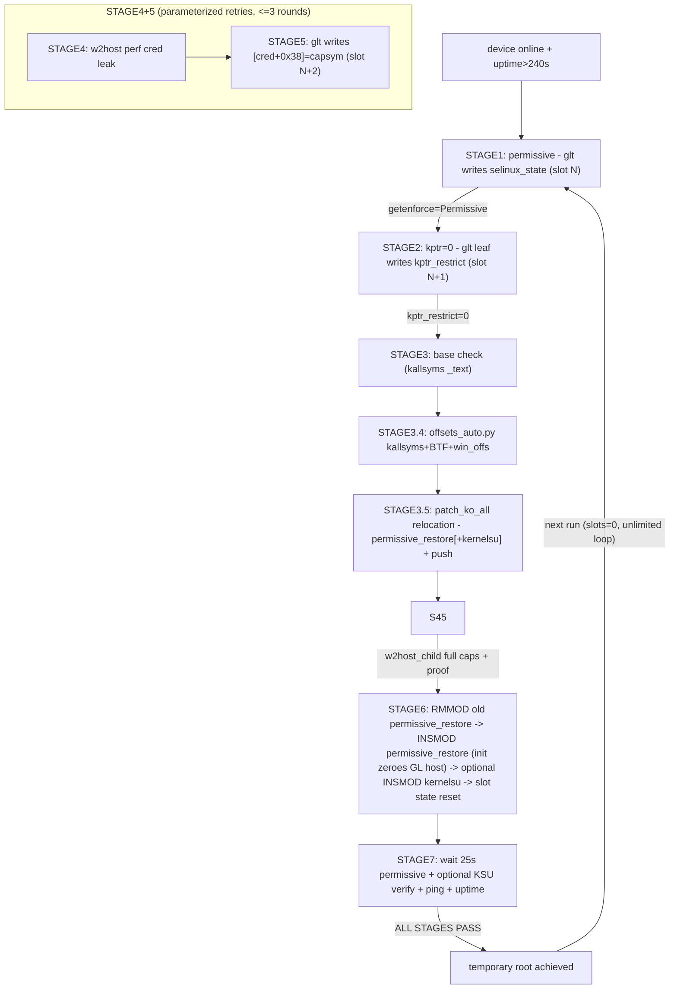

<!--
SPDX-FileCopyrightText: 2026 GhostLock-X200 contributors
SPDX-License-Identifier: Apache-2.0
-->
# GhostLock-X200 — 架构与流程

## 1. 概述

基于 CVE-2026-43499（GhostLock）的 vivo X200（PD2415 / Dimensity 9400 / b57 内核 6.6.89）临时 root 工具链。

```mermaid
flowchart LR
    subgraph PC[Windows PC]
        PS["root_full_permissive_restore.ps1 (STAGE1-7)"]
        PY["Python tools: offsets_auto / patch_ko_all / rootcmd_client"]
        OFF["win_offs_b57.json image offsets"]
    end
    subgraph DEV[Device side (Android)]
        GLT["glt write-primitive engine"]
        W2["w2host cred leak + CAPSROOT + rootcmd"]
        SU["su_daemon root shell service"]
        KSU["kernelsu.ko (optional, user-supplied)"]
        MR["permissive_restore.ko (permissive + host zeroing)"]
    end
    subgraph KERN[Kernel objects]
        ZERO["__dump_skip.zeroes 4KB GL_LOCK host (256 slots)"]
        SE["selinux_state"]
        KR["kptr_restrict"]
        CRED["cred (cap_permitted)"]
    end
    PS -- adb push/exec --> GLT & W2 & MR & KSU & SU
    PS -- adb forward + python --> W2
    PS -- read/inject --> OFF
    PS -- offsets_auto dynamic values --> GLT
    GLT -- "rb_erase write primitive" --> SE & KR & CRED
    GLT -- "trylock pollution/reuse" --> ZERO
    W2 -- "perf sampling cred leak" --> CRED
    W2 -- "CAPSROOT then insmod" --> MR & KSU
    MR -- "25s permissive restore + init zeroing" --> SE & ZERO
    KSU -- "root management + module loading" --> SU
```

## 2. 仓库布局

### 2.1 `exploit/` — 设备端 exploit 源码（`src/` + `vendored/` + `assets/` + `build/`；NDK 交叉编译 -> glt / w2host）

| 文件 | 功能 |
|---|---|
| `main.c` | 入口 `run_exploit`：路由（GL_USE_SLIDE / GL_FOPS_HIJACK / PHYSRW）；waiter/owner/consumer 三线程模型 |
| `slide.c` | **核心写原语引擎**：pselect 栈覆盖悬垂 rt_waiter words[]；SIGUSR1 remove_waiter -> 链式遍历 -> rb_erase "任意写"；GL_LOCK/GL_TARGET/GL_W0/GL_TASK_W2/GL_TARGET_LEAF 全参数化；事件同步确定性时序 |
| `fops.c` | fd_set words 构造 + pselect 路由 + fops 劫持（KASLR 泄漏、configfs 读原语） |
| `pipe.c` | pipe 对象 slab spray + PHYSRW 物理读写 |
| `util.c` | payload 布局构造：fake_lock/fake_fops/fake_task words、SKB payload、mm slab spray 上下文；kernelsnitch 辅助 |
| `root.c` | root 验证：selinux/uid/capable 探测、capset 提权、文件写检查 |
| `preload.c` | 提权后 payload：tmpfs 挂载、su daemon 部署、壁纸伪装 |
| `su_daemon.c` | root shell 守护：unix socket 服务；处理 vivo PR_SET_KEEPCAPS 怪癖（PR_SET_SECUREBITS） |
| `physscan.c` | 物理内存扫描/验证（配合 PHYSRW） |
| `w2host.c` | **cred 泄漏 + CAPSROOT + rootcmd**：perf 采样 getuid/geteuid IP 窗口泄漏子进程 cred；capset 完整提权；rootcmd socket（ID/READ/WRITE/INSMOD/RMMOD/EXEC） |
| `common.h` / `target_x200.h` | 常量：SKB/pipe/mm 布局、PAGE_OFFSET、b57 结构偏移 |
| `su_blob.S` / `wallpaper_blob.S` / `standalone_main.c` / `physscan_stub.c` | 内嵌汇编 blob 与独立入口 |
| `offset.h` / `kernelsnitch/` | vendored IonStack（Apache-2.0）组件：TARGET_CONFIG_H shim + mm_struct 泄漏头文件 |
| `build_glt_esync.sh` / `build_w2host.sh` | 自包含 NDK 构建脚本（aarch64-linux-android28-clang；-o/-n 参数） |

### 2.2 `modules/permissive_restore/`

| 文件 | 功能 |
|---|---|
| `permissive_restore.c` | init：恢复 initialized=1、清零 GL 宿主（每次 boot 无限提权）、commit_creds(root)；worker：25s 后字节写 enforcing=0，然后等待 kthread_should_stop()（无 rmmod UAF） |
| `Makefile` / `build_permissive_restore.sh` | Kbuild（`obj-m := permissive_restore.o`）+ 参数化构建（KSRC/CC/LD） |
| `permissive_restore.ko` | 随树分发的预编译模块（由源码构建，GPL-2.0-only；INSMOD 前用 patch_ko_all.py repatch） |

### 2.3 `modules/kernelsu/` — KernelSU 内核模块（vendored）

| 文件 | 功能 |
|---|---|
| `kernelsu.ko`（+`.license`） | 随树分发的预编译模块（官方 KernelSU v3.2.5 release 资产 `android15-6.6_kernelsu.ko` + 经 `patch_vermagic.py` 做 vermagic 适配匹配 X200 b57，GPL-2.0-only；INSMOD 前用 patch_ko_all.py repatch） |
| （对应源码） | 官方 KernelSU v3.2.5 `kernel/` @ `b0bc817b`（https://github.com/tiann/KernelSU，GPL-2.0-only；见 SOURCE-URLS.md） |

### 2.4 `tools/` — PC 端脚本（`scripts/` + `offset_tools/`）

| 文件 | 功能 |
|---|---|
| `scripts/root_full_permissive_restore.ps1` | **主脚本** STAGE1-7：permissive -> kptr -> offsets -> cred 泄漏 -> CAPSROOT -> INSMOD -> 验证；GL_LOCK 槽位轮转；参数化重试；permissive_restore 无限提权 |
| `scripts/root_full_official.ps1` | legacy 对照（仅 KSU，保持 enforcing；硬编码 b57 地址 - COMPATIBILITY） |
| `offset_tools/offsets_auto.py` | 动态偏移合成：kallsyms(base+capsym) + BTF(结构偏移) + win_offs(镜像) |
| `offset_tools/patch_ko_all.py` | ko 重定位（当前 boot kallsyms 绝对地址；`__versions` strip） |
| `offset_tools/win_offs_b57.json` | b57 镜像固有偏移（设备派生，GENERATED - 见 REUSE.toml） |
| `offset_tools/rootcmd_client.py` | rootcmd socket 客户端 |
| `offset_tools/unpack_boot.py` | boot.img 解包（payload 提取用外部工具 - 见 README） |
| `scripts/restart_w2.sh` | 设备端辅助（重启 W2 host） |

### 2.5 其他

| 路径 | 功能 |
|---|---|
| `SOURCE-URLS.md` | 外部/上游来源及版本 |
| `LICENSE` / `NOTICE` / `THIRD_PARTY_NOTICES.md` / `LICENSES/` / `REUSE.toml` | 许可与来源 |
| `README.md` | 用户文档 |

## 3. 提权链（STAGE1-7）



## 4. 关键机制

### 4.1 GL_LOCK 宿主槽位轮转
- 宿主：`__dump_skip.zeroes`（bss 4KB 全零，偏移 0x2342820）
- 槽位：0x10/槽 x 256（实证：trylock 污染仅 [h+0] 4B）
- 每次写使用新槽位；`permissive_restore` 在 INSMOD 时清零宿主 -> 槽位 0 -> 每次 boot 无限次提权。

### 4.2 permissive_restore
- init：恢复 initialized -> 清零 GL 宿主 -> commit_creds(root)
- worker：25s 后 enforcing=0；等待 `kthread_should_stop()`（无 rmmod UAF）

### 4.3 w2host
- perf 采样 getuid/geteuid `ldr x8,[x8,#0x820]` 窗口；3 轮交集去重
- CAPSROOT：glt 写 [cred+0x38]=capsym -> 子进程 capset 完整提权 -> rootcmd socket

### 4.4 版本适用性
- OK：b57 内核 6.6.89（16.1.12.2.W10 已实测；16.1.12.12 同构建未实测）
- FAIL：内核 >= 6.6.140（CVE 已修复）
